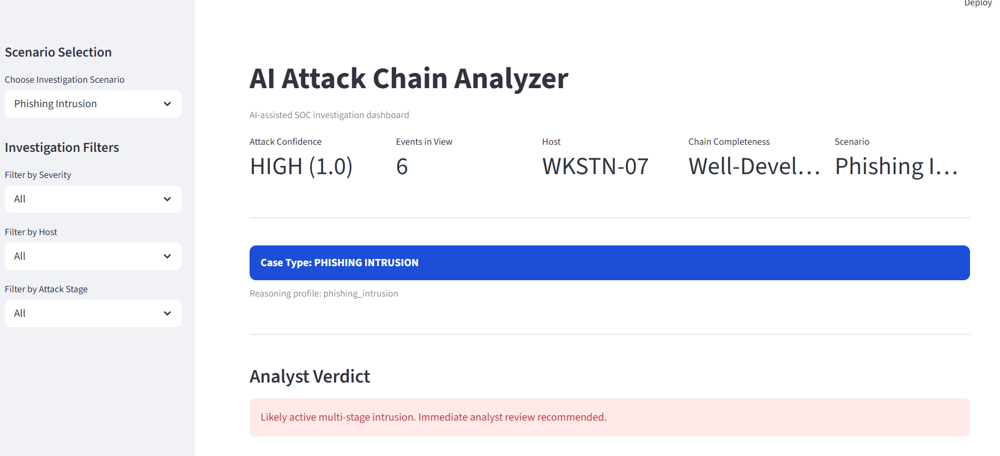
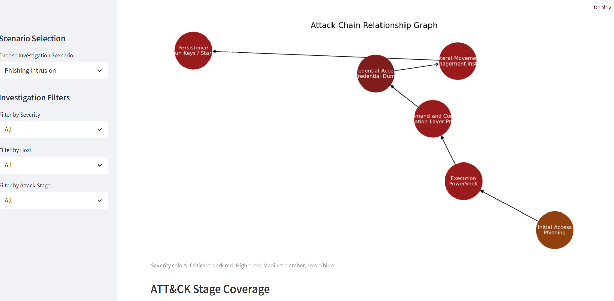
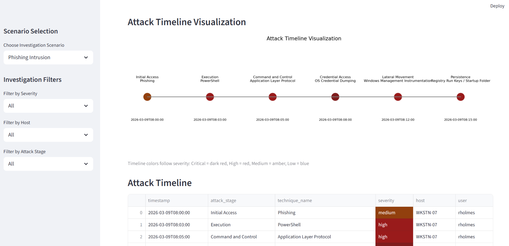
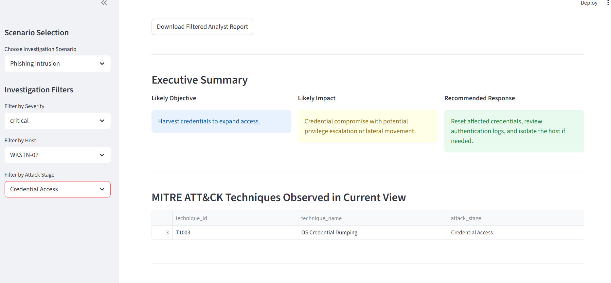

# AI Attack Chain Analyzer

## Key Capabilities

- **Attack Chain Reconstruction** – Correlates endpoint telemetry into multi-stage adversary attack chains.
- **MITRE ATT&CK Mapping** – Maps observed activity to ATT&CK tactics and techniques for investigation context.
- **SOC Investigation Dashboard** – Interactive Streamlit interface for threat hunting and security analysis.
- **Threat Reasoning Engine** – Infers attacker objectives, impact, and recommended response actions.
- **Attack Graph Visualization** – Visualizes adversary progression across the attack lifecycle.
- **Timeline Analysis** – Displays adversary activity progression across time.
- **Scenario Simulation** – Includes phishing intrusion, credential theft, ransomware precursor, and insider misuse cases.
- **Analyst Reporting** – Generates exportable investigation summaries for incident response documentation.

---

AI-assisted SOC investigation dashboard that reconstructs cyber attack chains from endpoint telemetry and maps activity to MITRE ATT&CK techniques.

AI-assisted SOC investigation dashboard that reconstructs cyber attack chains from endpoint telemetry and maps activity to MITRE ATT&CK techniques.

This project simulates multi-stage cyber intrusion scenarios and demonstrates how detection engineering pipelines convert raw telemetry into actionable security investigations.

---

## Features

- Attack chain reconstruction from endpoint telemetry
- MITRE ATT&CK technique mapping
- Scenario-based investigation simulation
- Threat reasoning engine
- Analyst verdict and executive summary
- Interactive SOC investigation dashboard
- Attack graph visualization
- Timeline visualization of adversary activity
- Exportable analyst investigation report

---

## Example Scenarios

The dashboard supports multiple simulated attack investigations:

- Phishing-based intrusion
- Credential theft campaign
- Ransomware precursor activity
- Insider data exfiltration

Each scenario demonstrates how different attacker behaviors appear in telemetry and how they can be correlated into an attack chain.

---

## Dashboard Preview

### Attack Graph

### Attack Timeline

### Investigation Filters

## Dashboard Capabilities

---

The investigation dashboard provides:

- Host, severity, and attack stage filtering
- Attack chain progression view
- Graph visualization of adversary activity
- MITRE ATT&CK technique mapping
- Timeline visualization
- Evidence summary and key findings
- Executive summary with attacker objective and recommended response
- Exportable analyst investigation report

---

## Running the Project

Clone the repository:
git clone https://github.com/YOURUSERNAME/ai-attack-chain-analyzer.git
cd ai-attack-chain-analyzer

Install dependencies:
pip install -r requirements.txt

Launch the dashboard:

streamlit run app/dashboard.py

The Streamlit dashboard will open in your browser.

---

## Configuration

Attack scenarios are provided as JSON datasets located in the `data/` directory.

data/
sample_attack_chain.json
credential_theft_chain.json
ransomware_precursor_chain.json
insider_misuse_chain.json

Each dataset represents a different investigation scenario and can be selected from the dashboard sidebar.

---

## Project Architecture

app/
dashboard interface

src/
attack chain reconstruction
detection logic
reasoning engine

data/
simulated attack scenarios

---

## Technologies Used

- Python
- Streamlit
- Pandas
- NetworkX
- Matplotlib
- MITRE ATT&CK mapping

---

## Purpose

This project demonstrates how detection engineering and threat hunting workflows can reconstruct adversary attack chains from endpoint telemetry and provide analysts with contextualized investigation insights.

Save the file.
